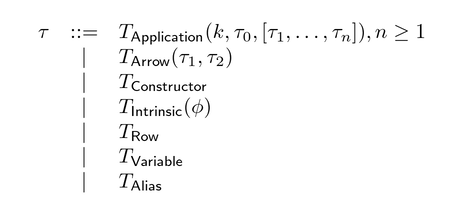
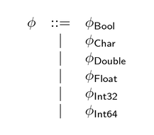

# Noll documentation

## Synopsis

```
   --------------------     -------------     -------------     -----------------
   | Surface language | --> |  Lowpass  | --> |  LLVM IR  | --> |  Object code  |
   --------------------     -------------     -------------     -----------------

   - Parsing
   - Type checking/inference
   - Syntax analysis
   - Desugaring
```

## Language overview

### Language primitives

Noll supports the following language primitives.

| Name           |  Description                                                 
| -------------- |  ---------------------------------------                        
| unit           |  Unit value                                    
| TODO           |                                                

### Type system





### Expression grammar

#### Labels

#### AST

#### Bindings

#### Match clauses

#### Operators

### Module structure

## Compiler

### Translation pipeline

#### Pre-translation

#### Type checking

The type inference algorithm collects constraints from the untyped syntax tree,
and then solves these to obtain a substitution that can be applied to the tree.

```
             let                           let
              |                             |
              |                             |
              f                             f ---------- ?
             / \                           / \
            /   \                         /   \
           /     \                       /     \
         lam      @                    lam      @ ------ ?
          |      / \                    |      / \
          |     /   \                   |     /   \
          x    f     3       ? -------- x    f     3
          |                             |     \
          |                             |      o-------- ?
         (+)                 ? ------- (+)  
         / \                           / \
        /   \                         /   \
       x     1               ? ----- x     1
```

In addition to simple equality, two extra types of constraints are needed to 
handle qualified types.


#### Passes

#### Records
